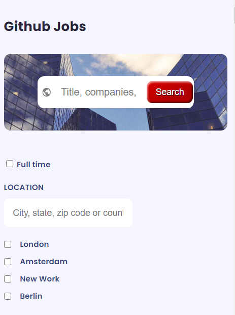
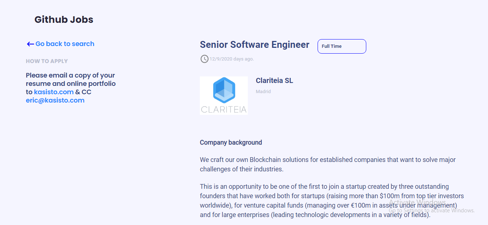
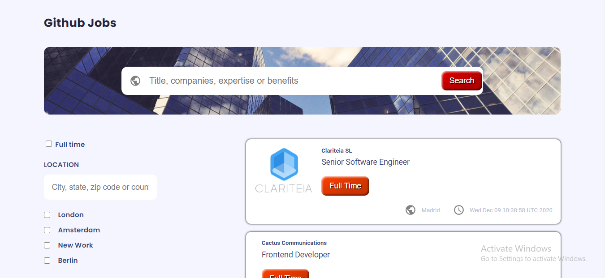

# **GITHUB JOBS**

# **Few details about this project:**

<h1 align="center">Github Jobs</h1>

  <h3>
    <a href="https://github-jobs-jacquit-netlify-app.netlify.app">
      Demo
    </a>
     | 
    <a href="https://github.com/Tanosimboangy/github-jobs">
      Solution
    </a>
  </h3>

# **You can find the demo of this project here:** 
  - If you want to find the demo about my project, you can click this demo link: 

<a href="https://github-jobs-jacquit-netlify-app.netlify.app">Demo</a>
.
  - This is from Netlify but if you want to look at the solution here is the link: 

#   **What was your experience:**
  -  Franckly, I had a lot of experience while doing this project: 

  -  First of all, for starting this project, I created all of  the necessary files such as, index.html, which is responsible for the html, index.scss, which is responsible for the styles and index.js which is responsible for the functionality. 

  - Secondly, this is the first time I used axios, which is
  a library that helps us make http requests to external resources. Axios uses methods like get() and post() that perform http GET and POST requests for retrieving or creating resources.

  - Apart from that, I had a great deal of difficulty to render the lists of jobs, but even so, could manage to render properly the lists of the jobs and their contents on the browser, also, I coiuld display the description of each job.

#   **In a few sentences, explain the structure of my project:**
  - First and foremost, apart from index.hmtl, index.scss, index.js, I have few components in which I structure all of my code in order to do this project.

  - In the GlobalContext: where you can see I fetch the data from the given API with axios, and I created a context there so that I can pass the state and the dispatch to the children.

  - I have the first search input inside of the Header component, and the three ones inside of the FilteringListsComponents in order to simplify to handle them in one location.

  - Besides, I have Mainlists component in which I have the FilteringListsComponents and the ShowingJobsLists component.

  - Inside of the FilteringListsComponents component I have the form for the input and checkbox.

  - In this ShowingJobsLists component, I display the lists of the jobs and the the content about them.

  - In the JobDescription component, I have the the description of each one of the jobs, where the user can find the details.

#  **If I had more time, I would you improve:**
  - First, I would like to improve the way how I fetched the data and the way how I handle the search and input form.
  - Also, I would cleanse my code very well so that it's easy for others to understand it.

#   **New I learned while working on this project:**
  - I learned how to use axios to fetch data and use cors for getting the data from the API when it is blocked.
  - Another than that, I learned how to convert markdown text into html text by using this key word: 

# **What was the most challenging part for you**
 
  - According to what I encountered while working on this project, to handle the search and the input form is the most challenging. On top of that, I had no idea of how to create the pagination in order to show ten lists of jobs for each page. I could not complete the coumpound component because I knew that I would not have enough time for it so I'd rather trying to deal with the filtering instead.

